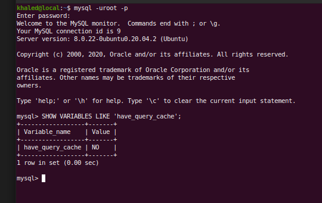
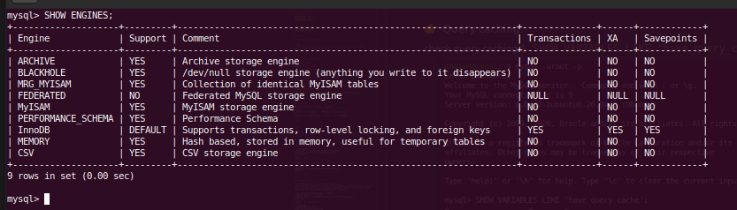

# PHP Notes

Khaled Alam's notes. Ref: books, articles, discussions, my experience.<br>

Reach me out: <a href="mailto:khaledalam.net@gmail.com">khaledalam.net@gmail.com</a> &nbsp; &nbsp; | &nbsp; &nbsp; <a href="https://linkedin.com/in/khaledalam">LinkedIn</a><br><br>
If you find this repo useful don't forget to give it a star ⭐

<br>

<Br><br>

---
<br><br>

## 🎉  Some of new features in PHP 8 <small><i>(will be released in November 26, 2020)</i></small>

<br>

### 👉 Union types

```php
public function foo(Foo|Bar $khaled): int|float;

public function foo(Foo|null $foo): void;

public function bar(?Bar $bar): void;
```
<br>

### 👉 The nullsafe operator


```php
// in old PHP versions
$obj = $khaled->getHints();
$result = $obj ? $obj->level(5) : null;

// in PHP 8 you can use 1 line
$result = $khaled->getHints()?->level(5);
```
<br>

### 👉 Constructor property promotion

```php
// in old PHP version
class KhaledAlam 
{
    public Mood $mood;
    private Creativity $creativity;
    
    public function __construct(
        Mood $mood,
        Creativity $creativity,
    ) {
        $this->mood = $mood;
        $this->creativity = $creativity;
    }
}

// in PHP 8 you can use parameters only in constructor
class KhaledAlam 
{
    public function __construct(
        public Mood $mood,
        private Creativity $creativity,
    ) {}
}
```

<br>

### 👉 Throw expressions in many new places
```php
$khaled_alam = $_POST['new_ideas'] ?? throw new \Motivationless('rethink');
```
<br>

### 👉 Allowing `::class` on objects
```php
// in old PHP versions
$foo = new Foo();
var_dump(get_class($foo));

// in PHP 8 you can use `::class`
var_dump($foo::class)
````
<br>

### 👉 Allow trailing comma in parameter lists
```php
public function Khaled(
    Translator $trans,
    float $amount,  // <---
) {
    // …
}
```
<br>

<i><small>use google to read about more features.</i></small>

--------

<br><br>

## 🎉  Some of new features in PHP 7
<br>

### 👉 Type hints

```php

<?php

// scalar type hints are nonrestrictive
function age(int $age)
{
    return $age;
}

echo age(10) . PHP_EOL;   // 10
echo age(10.5) . PHP_EOL; // 10

?>
```


```php
<?php

declare(strict_types = 1);

// scalar type hints are nonrestrictive
function age(int $age)
{
    return $age;
}

echo age(10) . PHP_EOL;   // 10
echo age(10.5) . PHP_EOL; // PHP Fatal error:  Uncaught TypeError: Argument 1 passed to age() must be of the type int, float given

?>

```

<br>

### 👉 Namespaces and group use declarations


```php
use Some\Namespace\{ Class_1, Class_2 };
use function Some\Namespace\{ Func_1, Func_2 };
use const Some\Namespace\{ CONST_1, CONST_2 };
```
```php
use Some\Namespace\{ 
    Class_1,
    Class_2,
    function Func_1,
    function Func_2,
    const CONST_1,
    const CONST_2 
};
```

>> In PHP, it is not required to divide classes in subfolders
according to their namespace, as is the case with other
programming languages. Namespaces just provide a logical
separation of classes. However, we are not limited to placing
our classes in subfolders according to our namespaces.


<br>

### 👉 The anonymous classes

```php

$myName = new class('Khaled Alam') {
    public function __construct(string $name)
    {
        echo $name;
    }
};
// Khaled Alam
```

<br>

### 👉 Old-style constructor deprecation
```php
class Khaled{
    public function __construct()
    {
        echo "is this constructor now?";
    }

    // this is normal function since __construct is existed in the class, otherwidse it will be considered as constructor and it will show a deprecated message.
    public function khaled()
    {
        echo "is this constructor now?";
    }
}
```

<br>

### 👉 The Spaceship operator

<br>

operator: `<=>`
```
- It returns 0 if both the operands on left- and right-hand sides are equal

- It returns -1 if the right operand is greater than the left operand

- It returns 1 if the left operand is greater than the right one
```

```php
function sort1($a, $b) : int
{
    if( $a == $b )
        return 0;
    
    if( $a < $b )
        return -1;

    return 1;
}

// and

function sort2($a, $b) : int 
{
    return $a <=> $b;
}

// are equals!

echo(sort1(10, 15)); // -1
echo(sort1(15, 10)); // 1
echo(sort1(10, 10)); // 0


echo(sort2(10, 15)); // -1
echo(sort2(15, 10)); // 1
echo(sort2(10, 10)); // 0
```

<br>

### 👉 The null coalesce operator

`??`
```php
// if $_GET['name'] not set or is null then $name will be equal 'Khaled Alam'
$name = $_GET['name'] ?? 'Khaled Alam';
```

<br>


### 👉 Uniform variable syntax
```php
$varName = 'name';

$name = 'Khaled Alam';

echo ${$varName}; // Khaled Alam
```
<br>

### 👉 Miscellaneous changes

const array

```php
define('currency', ['dollar', 'euro']);
```
multiple default cases

`session_start( [ ] )` override the session settings in the php.ini file.


<br>


### 👉 IntlChar

You need to have Intl extension installed.

```php
echo IntlChar::charName('!') . PHP_EOL; // EXCLAMATION MARK

echo (IntlChar::isWhitespace(' ') ? 'Yes' : 'No') . PHP_EOL; // Yes
```

<br>

<i><small>use google to read about more features.</i></small>

--------

<br><br>

## 🛠 Performance
<br><br>


### 👉 Looping with variable size

When doing a loop which requires an element that has a variable size such as an array you need to fetch the size before running through the loop.


> Incorrect:
```php
for ($i = 0; $i < sizeof($array); $i++)
{
    ...
}
```


> Correct:

```php
$size = sizeof($array);
for ($i = 0; $i < $size; ++$i)
{
    ...
}

/* OR */

for ($i = 0, $size = sizeof($array); $i < $size; ++$i)
{
    ...
}
```

<br>


### 👉 Inclusions

_once
Using `include_once()` and `require_once()` is slower than `include()` and `require()` and should be using only in files where multiple inclusions might occur.


<br>


### 👉 Typecasting

Using a type casting functions is slower that using direct typecasting


> Slow:
```php
$i = intval($value);
$j = settype($var, 'float');
```


> Fast:

```php
$i = (int) $value;
$j = (float) $var;
```


`(int)` typecast is ~ **2X** faster than `intval()`!<br>
`(int)`  -> https://ideone.com/QggNGc - `0.22s 20520KB  - php 7.3.5`<br>
`intval()` -> https://ideone.com/6Y8mPN  - `0.4s 20520KB - php 7.3.5`<br>
benefit of `intval()` can be passed a base from which to convert. `(int)` cannot.

<br>


### 👉 Incrementing

The use of ++ and -- before the variable on a incrementation is faster than after.


> Slow:
```php
$i++;
$j--;
```


> Fast:

```php
++$i;
--$j;
```

<br>

### 👉 Caching static files 


> Apache `in (.htaccess file)`

```apacheconf
<FilesMatch "\.(ico|jpg|jpeg|png|gif|css|js|woff)$">
    Header set Cache-Control "max-age=604800, public
</FileMatch>
```
`604800 = 7days`
<br><br>

> NGINX `in (/etc/nginx/sites-available/your-virtual-host-conf-file)`

```apacheconf
Location ~* .(ico|jpg|jpeg|png|gif|css|js|woff)$ {
    Expires 7d;
}
```

<br>

### 👉 HTTP keep-alive

>> In HTTP keep-alive, a single TCP/IP connection is
used for multiple requests or responses. It has a huge performance improvement over the normal connection as it uses only a single connection instead of opening and closing connections for each and every single request or response.

- The load on the CPU and memory is reduced.
- Network congestion is reduced.
- Reduces latency in subsequent requests after the TCP connection is
established.

> Apache `in (.htaccess file)`

```apacheconf
<ifModule mod_headers.c>
    Header set Connection keep-alive
</ifModule>

KeepAlive On
MaxKeepAliveRequests 100
KeepAliveTimeout 100
```
MaxKeepAliveRequests 0 (0 = unlimited)<br><br>

> NGINX `in (/etc/nginx/sites-available/your-virtual-host-conf-file)`

```apacheconf
keepalive_requests 100
keepalive_timeout 100
```

<br>

### 👉 GZIP compression
>> Content compression provides a way to reduce the contents' size delivered by the
HTTP server. Both Apache and NGINX provide support for GZIP compression, and
similarly, most modern browsers support GZIP. When the GZIP compression is
enabled, the HTTP server sends compressed HTML, CSS, JavaScript, and images
that are small in size. This way, the contents are loaded fast.

> Apache `in (.htaccess file)`

```apacheconf
<IfModule mod_deflate.c>
    SetOutputFilter DEFLATE
    #Add filters to different content types
    AddOutputFilterByType DEFLATE text/html text/plain text/xml text/css text/javascript application/javascript
    #Don't compress images
    SetEnvIfNoCase Request_URI \.(?:gif|jpe?g|png)$ no-gzip dont-vary
</IfModule>
```

> NGINX `in (/etc/nginx/sites-available/your-virtual-host-conf-file)`

```apacheconf
gzip on;
gzip_vary on;
gzip_types text/plain text/xml text/css text/javascript application/x-javascript;
gzip_com_level 4;
```

<br>

### 👉 Using PHP as a separate service
>> Apache used `mod_php` if we used it then we increase load of server resources (we can use PHP-FPM).
Nginx doesn't support such mods thus the PHP always used in a separate service.
<br>when we seperate php from the webserver. the webserver will forward the request to another external service which reduces the processing load on the web server.

<br>

### 👉 Disabling unused modules

> Apache
`$ sudo apachectl –M`

> NGINX
`$ sudo Nginx –V`

<br>

### 👉 Web server resources

> NGINX

>> NGINX provides two variables to adjust the resources, which are `worker_processes` and `worker_connections` . The worker_processes settings decide how many NGINX processes should run.<br><br>Now, how many `worker_processes` resources should we use? This depends on the server. Usually, it is one worker processes per processor core. So, if your server processor has four cores, this value can be set to 4.<br><br>`worker_connections` => `$ limit -u`


--------

<br><br>

## 📚 Databases
<br><br>

### 👉 Query caching

check query caching
`$ SHOW VARIABLES LIKE 'have_query_cache';`



to enable it in `my.cnf` file add

```conf
query_cache_type = 1
query_cache_size = 128MB
query_cache_limit = 1MB
```

then save and restart MySQL server.
<a href="https://dev.mysql.com/doc/refman/5.6/en/query-cache-configuration.html">more details</a>.

<br><br>

### 👉 Storage engines
Common ones MyISAM and InnoDB(default, >= v5.5)
<br>
the storage engine is the table's base, and different tables can have different storage engines in a single database.

change table engine:

```sql
ALTER TABLE some_table ENGINE=INNODB;
```


MyISAM|INNODB
---|---
✅ Good speed with fetch(SELECT)| ✅ Good
❌ Less update/delete| ✅ Good
✅ Table-level locking | ✅ Row-level locking
❌ **NO support** for foreign keys| ✅ Support foreign keys and forcing fks constraints 
✅ Support full-text search|
❌ **NO support** for transactions (COMMIT/ROLLBACK)| ✅ Support transactions (COMMIT/ROLLBACK)
✅ Support data compression, replication, query caching, data encryption | ✅ Support data compression, replication, query caching, data encryption
❌ **NO support** cluster database | ✅ can be used in cluster environment (but it does not have full support), Can be converted to NDB storage engine.

`innodb_buffer_pool_size` => the recommended
value is 50-80% of the installed RAM memory on the server.<br>
`innodb_buffer_pool_instances` => the recommended 1 instance per GB(innodb_bufer_pool_size)<br>
`innodb_log_file_size` => the recommended between 1 and 4 GB<br>

<br><br>

The Percona Server - a fork of MySQL (Linux)<br>
uses `XtraDB` engine which is an enhanced version of the InnoDB storage engine.

<br><br>

### 👉 In-memory caching
<br><br>


--------

<br><br>

## 🐞 Debugging


--------

<br><br>

## 🧪 Testing
<br><br>

--------

<br><br>

## 📈 Profiling
<br><br>


--------

<br><br>

## 🔨 Tools
<br><br>


<br>

---

<br>

Updates and new notes are always welcomed.<br>

If you find this repo useful don't forget to give it a star ⭐

Reach me out: <a href="mailto:khaledalam.net@gmail.com">khaledalam.net@gmail.com</a> &nbsp; &nbsp; | &nbsp; &nbsp; <a href="https://linkedin.com/in/khaledalam">LinkedIn</a>